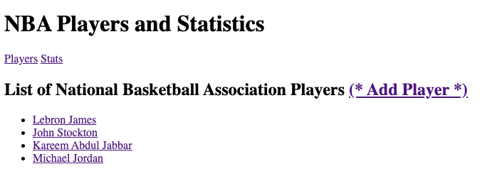

## Project title

Our project was the - NBA Player Statics Forum -

## Motivation

Our motivation was to pick something fun and intuitive for our outside viewers. We both love the game of basketball and went with that theme.

## Build status

Full functional Python CRUD with Django.

## Screenshots

## Tech/framework used

Python
Django
Bootstrap
HTML
CSS

NBA statistics: https://stats.nba.com/alltime/

## Features

At this time our project is MVP status.

## Code Example

## Installation

## How to use?

If people like your project they'll want to learn how they can use it. To do so include step by step guide to use your project.

## Contribute

Phil Morales & Sem Saint-Aubin

#### Anything else that seems useful
